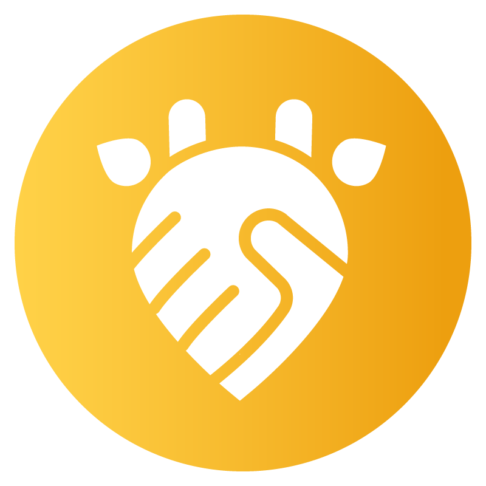
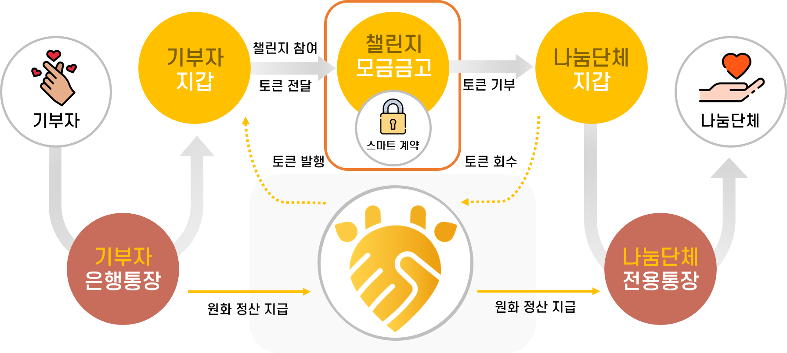

# :raised_hands: KIRIN(기린) - 기부 챌린지

- 좋아하는 연예인의 기부에 참여하고, 챌린지를 통한 재미와 기부로 인한 선한 영향력을 행사하는 

  **본격 아름다운 어플**

- 📜 [노션](https://www.notion.so/87a0097afb3944e8858dcc8639148bfb)

<br/>
<br/>


## KIRIN - 배경 

---



<br/>
<br/>

사랑하는 스타가 기부를 했을 때 뜻을 함께하고자 팬카페 회원들도 기부하는 경향이 늘고 있습니다. (임영웅 : 산불 피해 1억 기부 -> 팬카페 1300만원 기부). 스타 기부에 감명받아 기부에 참여하고 싶다면?

KIRIN은 연예인의 기부를 챌린지의 형태로 참여하고, 스타와 커뮤니티에서 소통하며 기부의 안정성을 위해 블록체인 장부를 활용해 선한 영향력을 행사하는 앱입니다!

<br/>

## 프로젝트 진행 기간

---

2022.08.29~ 2022.10.07(금) 약 39일간 진행<br/>
SSAFY 7기 2학기 특화프로젝트 - KIRIN

<br/>
<br/>

## :heart: 주요 기능 

---

- ### 스타(연예인)

  - **기부 챌린지 등록**
    - 원하는 기간, 목표 금액, 기부기관 선택을 하고 동영상을 올려서 챌린지를 등록할 수 있어요!
    - 챌린지 등록을 하면 자신을 구독하고 있는 팬들에게 **알림**이 갑니다!

    <br/>

  - **커뮤니티 작성**
    - 커뮤니티 기능을 통해 팬들과 소통할 수 있어요!
    - 챌린지를 등록할 예정이면 커뮤니티를 통해 미리 소통을!<br/>

<br/>

- ### 사용자(팬)

  - **기부 챌린지 참여**
    - 스타가 등록한 챌린지에 영상을 올려 기부에 참여할 수 있습니다!
    - 챌린지 참여만으로 스타의 기부에 기여할 수 있고, 필요하면 토큰을 충전하여 따로 기부도 가능합니다!
    - 만약 토큰을 많이 기부했을 시 명예의 전당에 등록!

    <br/>

  - **커뮤니티 및 스타 구독**
    - 좋아하는 스타를 구독할 수 있어요!
    - 구독한 스타가 커뮤니티 게시글을 작성 하거나 챌린지 등록 시 **알림**이 옵니다!
    - 좋아하는 스타를 구독해서 빠르게 소식을 받고, 소통해요!
    - 커뮤니티에서 스타가 등록한 게시글에 좋아요, 댓글을 달아보세요!

    <br/>

  - **나의 기부 & 마이페이지**
    - 본인이 참여한 기부 장부를 한눈에 볼 수 있습니다!
    - 블록체인 토큰을 충전해서 기부에 참여해보세요!
    - 본인이 구독한 스타들을 볼 수 있고, 참여한 챌린지와 좋아요 한 챌린지를 볼 수 있습니다!
      <br/>

<br/>
<br/>


- ### 수혜자(추후 예정)

  - 관리자에게 인증 받은 기부기관들은 수혜자로 등록이 됩니다!
  - 블록체인 스마트 컨트랙트로 안전하게 장부 확인이 가능합니다!
  - 챌린지 기간이 끝나면 인출 가능!

<br/>
<br/>

- ### 공통

  - **사바나**
    - 원하는 챌린지를 보는게 번거롭다고 하시는 분들을 위한 Savana 페이지!
    - 한 화면에 무작위로 진행 중인 챌린지들을 볼 수 있습니다!
    - 챌린지 상세 버튼을 클릭하면 기부에 참여한 일반인들의 영상, 기부 현황, 기부 정보를 볼 수 있습니다!
    - 댓글, 좋아요 가능!

  - **블록체인**
    - 블록체인 장부를 통해 모든 사용자들의 토큰 기부 등록, 충전 내역, 송금 내용을 확인 가능합니다!
    

<br/>



## :heavy_check_mark: 주요 기술 

---

**Backend - Spring**

- IntelliJ IDEA : 2021.3.1
- IntelliJ Runtime: 11.0.13+7-b1751.21 amd64
- JDK : 17-ea
- JRE : build 17-ea+14
- JVM : build 17-ea+14, mixed mode, sharing
- DB : 8.0.30-MySQL
- Springboot : 2.7.3
- Gradle : 7.5
- ffmpeg : 4.4.1

**Frontend**

- Visual Studio Code IDE 1.69.0
- React : ^18.2.0
- React-Toastify : ^9.0.8
- Solc : ^0.8.17
- Web3 : ^1.8.0
- Node : 16.17.0

**CI/CD**

- Server : AWS EC2 Ubuntu 20.04 LTS
- Docker : 20.10.12
- nginx : 1.18.0
- Jenkins : 2.346.2

**BlockChain**

- go1.19
- Geth 1.9.24-stable
- Vagrant 2.3.0
- truffle v5.5.29

<br/>

## :heavy_check_mark: 협업 툴 / 환경

---

- GitLab
  - Git-Flow. develop, FE_develop, BE_develop 브랜치를 나누고
  - 각 feature별 브랜치를 따서 작업 진행
  - MR시 Front/Back Maintainer가 확인 후 합병
- Notion
  - 회의가 있을때마다 회의록을 기록하여 보관
  - 컨벤션 정리
  - api 문서 관리 등
- JIRA
  - 매주 월요일 목표량을 설정하여 Sprint 진행
  - 업무별 Story Point(1~4)를 설정, In-Progress -> Done 순으로 작업  
- MatterMost
  - Gitlab, JIRA 봇 연동하여 실시간으로 협업
  - Server 연동하여 실시간 에러 처리
- Webex
  - 회의 : 평일 아침 Webex에서 데일리 스크럼 진행
  - 문제점이 생겼을 때 팀원들에게 직접 소통


<br/>

## :heavy_check_mark: 팀원 역할 분배

---

- 이승연(Backend / CI/CD / 팀장)
- 류현수(Backend / BE maintainer)
- 이도엽(Frontend / FE maintainer)
- 이보나(Frontend / UCC maintainer)
- 이재순(Domain-BlockChain / Domain maintainer  )
- 김민균(Domain-BlockChain / Jira maintainer)

<br/>

## :heavy_check_mark: 프로젝트 산출물

---

- [기능명세서](docs/기능명세서.xlsx)
- [와이어프레임 & 스토리보드](https://www.figma.com/file/4ahkuF2GWXhVbXjb0zasqJ/WireFrame?node-id=0%3A1)
- [프로젝트계획서](docs/프로젝트계획서.pdf)
- [컨벤션&git](doc/컨벤션&Git.md)
- [API명세서](docs/API명세서.xlsx)
- [ERD](docs/ERD.jpg)
- [테스트케이스](docs/테스트케이스.xlsx)

## :heavy_check_mark: 프로젝트 결과물

---

- [중간발표자료](docs/중간발표자료.pptx)
- [최종발표자료](docs/최종발표자료.pptx)
  <br/>

## :heavy_check_mark: 폴더 구조 - Frontend

```
src
├─assets
│  ├─fonts
│  ├─img
│  └─sound
├─components
│  ├─challenge
│  │  └─select
│  ├─common
│  ├─community
│  ├─donation
│  ├─home
│  ├─my
│  ├─savana
│  ├─search
│  ├─setting
│  ├─sign
│  ├─star
│  └─wallet
├─pages
│  └─settings
├─smartcontract
└─utils
```

<br/>

## :heavy_check_mark: 폴더 구조 - Backend

```
src
├─main
│  ├─java
│  │  └─com
│  │      └─ssafy
│  │          └─kirin
│  │              ├─config
│  │              │  └─security
│  │              ├─contracts
│  │              ├─controller
│  │              ├─dto
│  │              │  ├─request
│  │              │  └─response
│  │              ├─entity
│  │              ├─repository
│  │              ├─service
│  │              ├─util
│  │              └─webhook
│  ├─resources
│  └─solidity
│      ├─build
│      │  └─contracts
│      ├─contracts
│      ├─migrations
│      └─test
└─test
    └─java
        └─com
            └─ssafy
                └─kirin
```

<br/>

## :heavy_check_mark: CI/CD

```
Ubuntu
├─Docker
│  ├─kirin-front : 0.0.0.0:443 -> 443/tcp, 0.0.0.0:80 -> 80/tcp
│  ├─kirin-back : 0.0.0.0:8999 -> 8999/tcp
│  ├─redis-container : 0.0.0.0:8379 -> 8379/tcp
│  └─mysql-container : 0.0.0.0:3306 -> 3306/tcp
│ 
└─Docker volume
   └─kirin_vol
```

<br/>

## :heavy_check_mark: 페이지 기능 소개 

- 홈


- 스타페이지


- 사바나 - 상세페이지


- 챌린지 참여 - 기부


- 마이페이지


- 블록-트랜잭션

